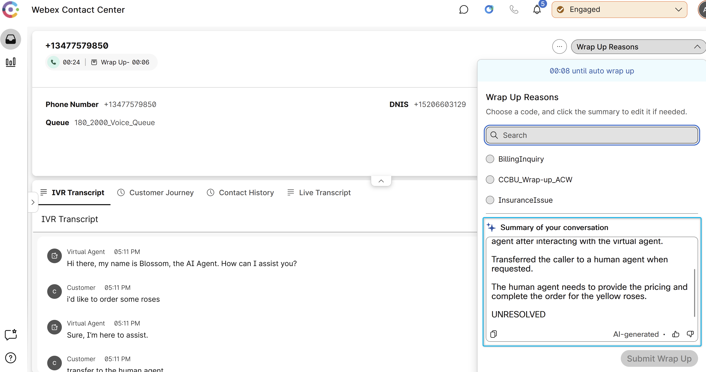

## Feature Description

The Webex Contact Center Wrap-up Summary AI feature is part of the AI Assistant capabilities designed to enhance agent productivity and customer experience. This feature automatically generates the conversations summaries based on the interactions between the agent and the customer during a contact center session. It helps agents by summarizing the conversation and recommending next actions, reducing manual effort and improving accuracy in post-call documentation. 

Benefits:

**Reduced agent workload**: By automatically generating wrap-up codes and summarizing conversations, agents spend less time on manual documentation. 
**Improved accuracy**: The AI-generated summaries and codes help ensure consistent and precise post-call records. 
**Enhanced customer satisfaction**: Thorough and accurate wrap-up improves follow-up actions and overall customer experience. 
**Increased agent efficiency**: Integration with other AI capabilities like virtual agent summaries and suggested responses helps agents work more effectively. 
**Recommended next actions**: The feature suggests follow-up steps, guiding agents on what to do after the interaction. 

## Mission Details

Your mission is to:

1. Enable Wrap-up Summary feature
2. Test Wrap-up Summary feature

## Build

### Task 1 [READ ONLY]. Order Provisioning & Control Hub Settings

1. You should purchase the new AI Assistant SKU **A-FLEX-AI-ASST** from CCW.

2. nce you purchase the offer, admins with the appropriate profile and access controls will be able to see the AI Assistant menu in Control Hub. After purchasing the offer, the customer can enable/disable the **Wrap-up summaries**.
   

3. The Agent needs to logged in to the Team that is configured with Desktop Layout that has Agent Assistance features configured. Default desktop layout already incude the AI Agent Assistance widget.
     Agents Team:
       
     Desktop Layout:
    

### Task 2. Test Wrap-up Summary feature.

1. Make sure the agent is in the availabe status.
   

2. Place a call to your channel. While connecting to the AI Agent, request a transfer to a human agent. Answer the call on the alpha Agent Desktop and engage in small talk about flower ordering. After disconnecting the call, the Wrap Up Summary window should appear, displaying a summary of the call between the caller and the agent.
   

<strong>Congratulations, you have officially completed this mission! 🎉🎉 </strong>
