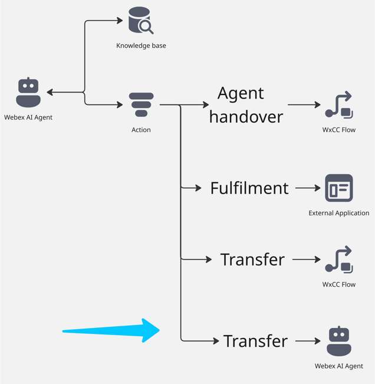

# Mission 3: Configure Fulfilment Action and create an order.

 **

What is Transfer to Webex AI Agent Action? 
**

Transfer Action is a task that an AI agent performs by understanding user intents and transferring the interaction back to the WxCC flow with custom data for connecting to another Webex AI Agent.

---

## Mission overview
Your mission is to:

For this mission, the proctor has created Webex AI Agent named **Flower_Wholesale**. The goal of this mission is to transfer the call from your AI agent to **Flower_Wholesale** using the Transfer operation.  
   

---

## Build

### Task 1. Adjust Transfer Action in AI Agent Studio portal. 

1. Open your AI agent with name **<copy><w class="attendee"></w>_2000_AutoAI_Lab</copy>** and then click on **Actions**. 
    

2. Select **Transfer_to_different_department** action. 
    

3. Adjust the Transfer condition by adding **<copy>or Wholesale</copy>** as the department option. 
    

4. Adjust entiry example by adding **<copy>Wholesale</copy>**. 
    

5. **Save** and **Publish** the changes. 
    

### Task 2. Configure Voice flow to Transfer the call to **Flower_Wholesale** AI Agent. 

1. Go to **Control Hub** and open up your flow **<copy>AutonomousAI_Flow_2000_<w class="attendee"></w></copy>**. Click on **Edit** the flow. 
    

2. Click on **Case** node and add one more option with value **<copy>Wholesale</copy>**.
    

3. Bring additionl **VirtualAgentV2** node to the flow.
    

4. Connect **Wholesale** output from **Case** node to **VirtualAgentV2**. Connect **Handled** output from **VirtualAgentV2** to the **DisconnectContact** node. Connect **Escalate** output from **VirtualAgentV2** to Queue that is configured with <w class="attendee"></w>_2000_Voice_Queue.
    

5. Click on the **VirtualAgentV2** and select **Webex AI Agent (Autonomous)** with name **Flower_WholeSale**.
    

6. **Validate** and **Publish** the flow. 
    

### Task 3. Test Webex AI Agent transfer to Webex AI Agent. '

Place a call to the number associated with your Channel **<copy><w class="attendee"></w>_2000_Channel</copy>** and ask to speak with the Wholesale department. You will be connected to an AI agent who can assist you with ordering flowers if you need to purchase at least one box (each box contains 100 flowers). In this case, the price will be different. Below, you can find the screenshot of the knowledge base used by the Flower_WholeSale AI Agent.
    

Or you can review the full configurations of the **Flower_Wholesale** AI Agent. 
    

For your reference, please see the chat discussion with the Flower_WholeSale AI Agent. This will help you have a similar dialogue during your test call.
    

<strong>Congratulations, you have officially completed this mission! 🎉🎉 </strong>
