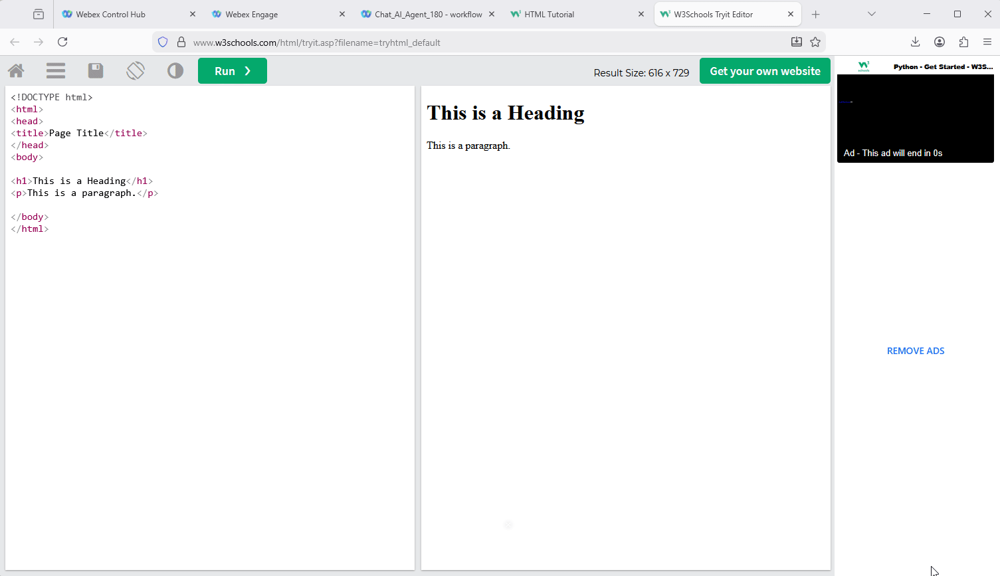

## Mission Objective

In this mission, you need to complete web chat configuration tasks, including creating a Chat Asset, linking it to a Channel, and test website.

## Build

### Task 1. Find your Service

1. Login to Webex Connect Portal.
   Go to **Services** and look for the service that you have created earlier. The name should be **<copy><w class="attendee"></w>\_2000_Service</copy>**
   

### Task 2. Configure and Register Chat Asset

1. While on Webex Connect portal, go to **Assets** -> **Apps**, press **Configure New App** and select **Mobile / Web** option.
   

2. Input **_Name_** as **<copy>Chat*App*<w class="attendee"></w>\_2000</copy>**.

3. Toggle/enable **_Live Chat / In-AppMessaging_** to **_ON_** and choose **_Primary Transport Protocol_** as **`MQTT`** & **_Secondary Transport Protocol_** as **`Web Socket`** then tick **_Use Secured Port_** checkbox and press **_Save_** button.
   

   > **Note**: If there is an error that your request cannot be processed, please press **_Save_** button one more time.

4. Once asset is saved, press **_Register To Webex Engage_** at the top.
   

5. Choose **<copy><w class="attendee"></w>\_2000_Service</copy>** from the drop-down list and press **_Register_** button.
   

6. Check and make sure the asset has been succesfully registered to the service and **_Register To Webex Engage_** button has been greyed out.
   

7. Return to **_Assets_** -> **_Apps_**, find **_ChatAsset_**, copy **_App ID_**, paste it into the text file and save. We will use it when configuring chat flow later.
   

### Task 3. Create Entry Point for Chat

1. Login to Control Hub and go to Channels and click on **Create Channel**.
   

2. Input **_Name_** as **<copy><w class="attendee"></w>\_2000_Chat_Channel</copy>**
   

3. Select **Chat** from the **_Channel Type_** drop-down list. Select **<copy>Chat*App*<w class="attendee"></w>\_2000</copy>** as an **_Asset Name_**. Set **_Service Level Threshold_** as **`360`** and click on **Save**.
   

### Task 4. Create Queue for Chat

1.  While on the **Control Hub** portal, go to Queues and click on **Create a queue**.
    

2.  Input **_Name_** as **<copy><w class="attendee"></w>\_2000_Chat_Queue</copy>**. Also select **`Chat`** in the **_Channel Type_** section.
    

3.  Scroll down to **Chat Distribution** click on **_Add Group_** and select **<copy><w class="attendee"></w>\_2000_Team</copy>**
    

4.  Set **_Service Level Threshold_** as **`7200`** seconds (2 hours). Set **_Maximum Time in Queue_** as **`10800`** seconds (3 hours). Click on **_Save_** after comparing your values with the screenshot below.
    

### Task 5. Website Widget Configuration

1.  Login to Webex Engage Portal from Control Hub.
    

2.  Go to **_Assets_** -> search and edit **<copy>Chat*App*<w class="attendee"></w>\_2000</copy>** which you have created in Connect Portal.
    

3.  Scroll down and click on **_Save Changes_** button.
    

4.  Scroll to top of the page and choose **_Websites_** tab. Click on **_ADD Website_**.
    

5.  Fill in the respective fields as per the table below:

    | **Parameter Name**            | **Parameter Value**        |
    | ----------------------------- | -------------------------- |
    | Chat Widget Language          | English-US                 |
    | Display Name                  | Flower Shop                |
    | Byline Text                   |                            |
    | Button Text                   | Start Chat                 |
    | First message                 | Hello! Welcome to the chat |
    | PCI Compliance Banner Message | This chat is PCI compliant |
    | Domain                        | \*.w3schools.com           |
    | Set wait time                 | Disabled                   |
    | Set Chat Announcement         | Enabled                    |

6.  Review the configuration and then **Save changes**.

7.  Scroll up, select **_Appearance_** and change the settings:

    > \[Optional\] Widget Color  
    > \[Optional\] Widget Button Type  
    > \[Optional\[ Logo  
    > Enable Emojis  
    > Enable Attachments  

Press **_Save changes_** button at the bottom of the page.

8.  Scroll up, select **_Widget Visibility_** tab and make sure that **_Force Turn Off Widget_** switch is disabled. Then select **_Widget Visibility_** as **_Show without any restrictions_** and save changes.
    

9.  Now click on **_<_** arrow near **_Website Settings_** and go-back to edit your chat asset.
    

10. Select **_Installation_**, then click on **_Copy_** to copy the chat script to clipboard.
    

### Task 6. Paste the script to the test website

1. Open up [https://www.w3schools.com](https://www.w3schools.com) and click on HTML.
   

2. Scroll down and click on **Try it Yourself**.
   

3. Delete the current HTML document details and paste the HTML script that you saved to the clipboard. Then click on "RUN". You should see the chat bubble shows up on the right down corner.
   

<strong>Congratulations, you have officially completed this mission! 🎉🎉 </strong>

