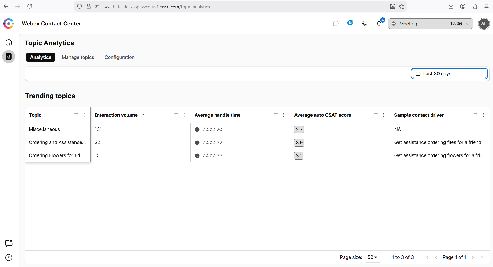

## Feature Description

The all-new topic analytics empowers you to discover emerging topics as customer interactions occur, providing instant visibility into evolving trends and concerns. By automatically labeling each interaction, you gain immediate, actionable insights that enable faster, data-driven decisions. This dynamic approach ensures your team can quickly adapt to changing customer needs, optimize operations, and stay ahead of potential issues.

## Build

### Task 1 [READ ONLY]. Review the upcoming UI for the Real-Time Topic Dashboard for Supervisors.

1. When the Administrator logs in the Agent Desktop, then can see the **Real Time Topic** module.
   

2. The Administrator can **Manage Topics** by merging, deleting or adding new topics.
   

3. In the **Configuration** section, the Administrator can enable Real-Time Topic Analytics for the organization and specify all queues or some specific queues.
   

### Task 2 [READ ONLY]. Review Real-Time topic on the Supervisor's Dashboard.

1. You can add **Topic Name** field the the Completed Interactions Dashboard.
   

2. You can filter the calls based on the specific **Topic** for the further review.
   

<strong>Congratulations, you have officially completed this mission! 🎉🎉 </strong>

