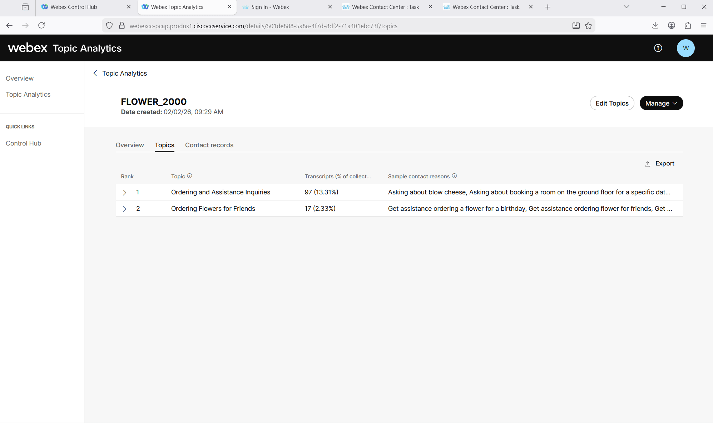
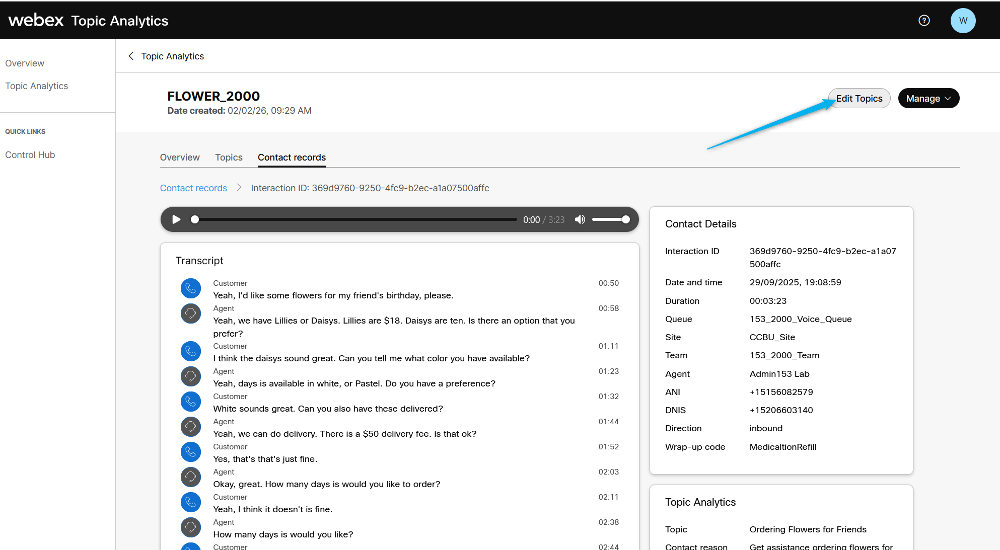
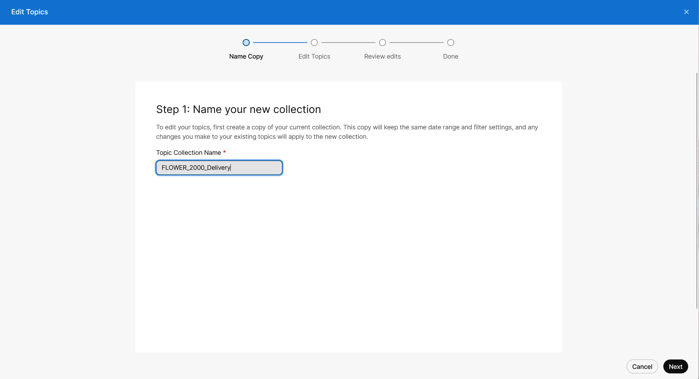
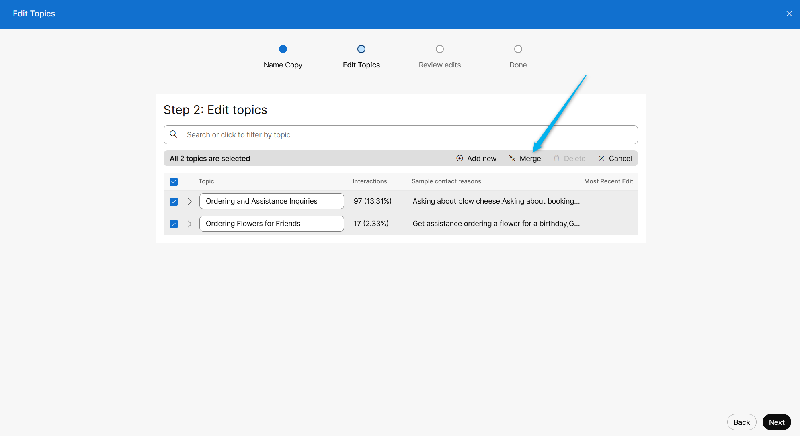
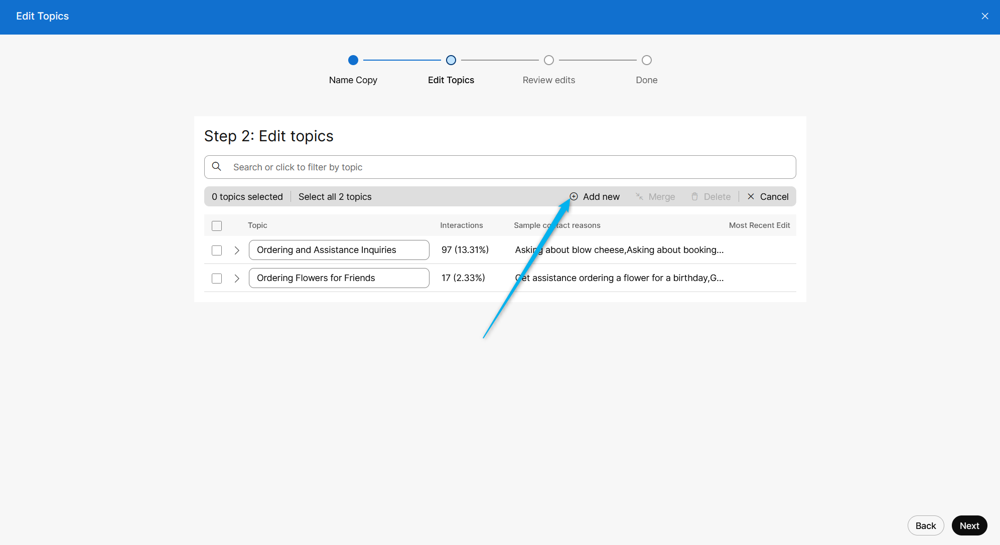
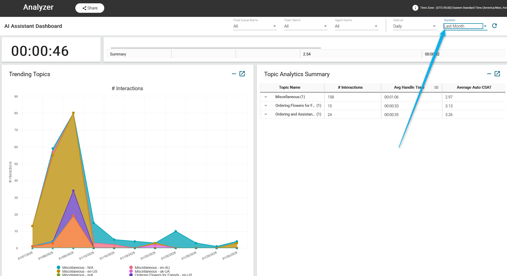
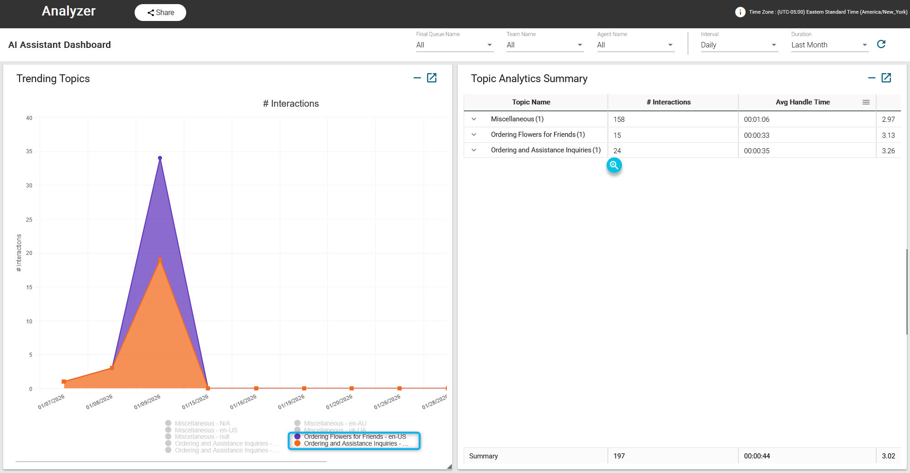
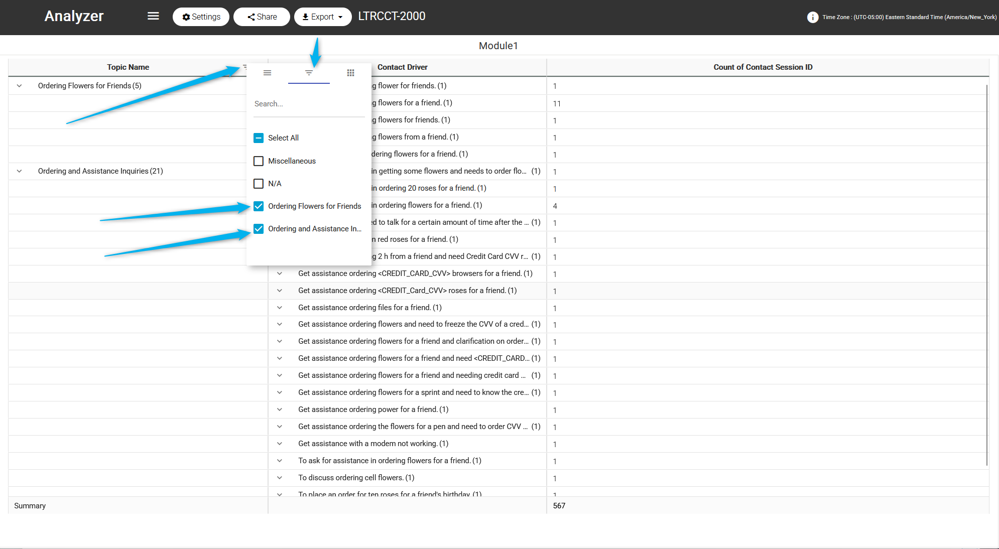

### Task 1. Review Flower Delivery Topic Collection.

1. Go to <b>Contact centre overview</b>. Under Quick Links , click on **Topic Analytics**. 
Enter your administrator login user, if prompted. 
   

2. On left side click on “Topic Analytics” and click on collection with name **Flower Delivery**.
   

3. Make a note of Total Analyzed interaction and how many of those has recording available.
   

4. Click on **Topic**. There are various **Topics** for which customers are contacting the Contact Center. Knowing this information gives the opportunities for automation and enhanced self-service through virtual agents. For example, one such topic could be **Ordering Flowers for Friends**. As a CX Architect/Business leader, you might consider implementing an AI agent capable of creating an order and scheduling deliveries.
   

5. There is option for you to download the Topics with details. Click on **Export**.
   

6. Next, click on the **Ordering Flowers for Friends** topic. This will take you to the **Contact Record** tab, which shows all the contacts associated with this topic, along with the date/time of those calls and the contact reason. If you open any of them, you can view details of the contact, the contact reason, transcripts, and even listen to the call recording.
   

### Task 2. [READ ONLY] Review steps to edit Topic Collection.

1. Topic Analytics enables you to modify your topic collections, allowing you to tailor the topics to better fit specific business needs, language, and terminology. You can rename topics, merge topics, delete topics, add new topics.   
Click on **Edit Topics** on the top-right corner.
   

2. In the Name Copy screen, edit the topic collection name. By default, Copy of existing collection name appears in the Topic collection name field. For this lab you can call it with any name you prepare. 
   

3.  Optionally, topics can be merged. [Please do not do it while working on this lab].
   

4. Or you can add a new topic, and the AI module will analyze the transcript specifically for the keywords that you provide. We will not be adding a new collection in this lab, as it requires some time for the system to generate the new collection.
   

### Task 3. Review Topic Analytics reports in AI Assistant Dashboard. 

1. From [Control Hub](https://admin.webex.com){:target="_blank"} login to Analyzer. 
   

2. Click on **Dashboard** and search for the Dashboard with name ***<copy>AI Assistant Dashboard</copy>***. Open the Dashboard with ID -1284.
   

3. Scroll down and select the duration as **Last Month**
   

4. To check the graph for flower-related topics, uncheck all other topics, leaving only **Ordering Flowers for Friends** and **Ordering and Assistance Inquiries**. The Miscellaneous are the calls that were analyzed not related to any topic yet. 
   

5. On the right side, you can see the **Topic Analytics Summary** card with additional information like Interactions, Avg Handle Time, and Average Auto CSAT. You can expand details about the interactions related to the topic by clicking on it.
   

### Task 4. Review custom Analyzer report for Topic Analytics.

1. While in the Analyzer portal, click on Visualizations and search for the report **LTRCCT-2000**. Open the report. You should see that there are two new profile variables in Analyzer that could be used to review the Topic details: **Topic Name** and **Contact Driver**.
   

2. You can filter the report to see specific topics. Select **Inquiry on Flower and Costs** and **Inquiry on Flower Order and Prices**
   

3. Review the report after applying the filter.
   

<strong>Congratulations, you have officially completed this mission! 🎉🎉 </strong>
