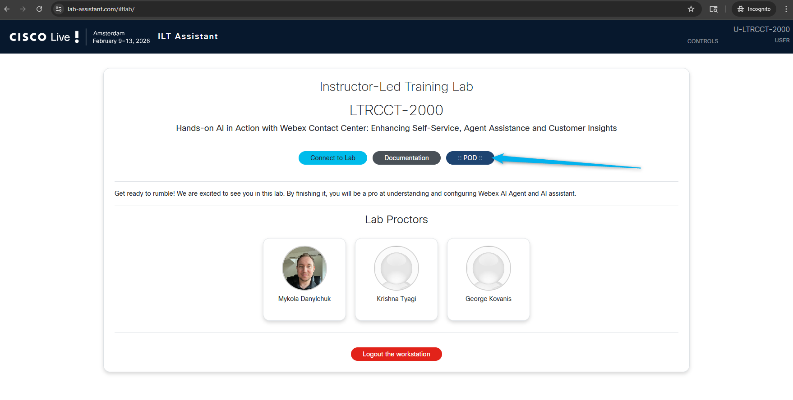
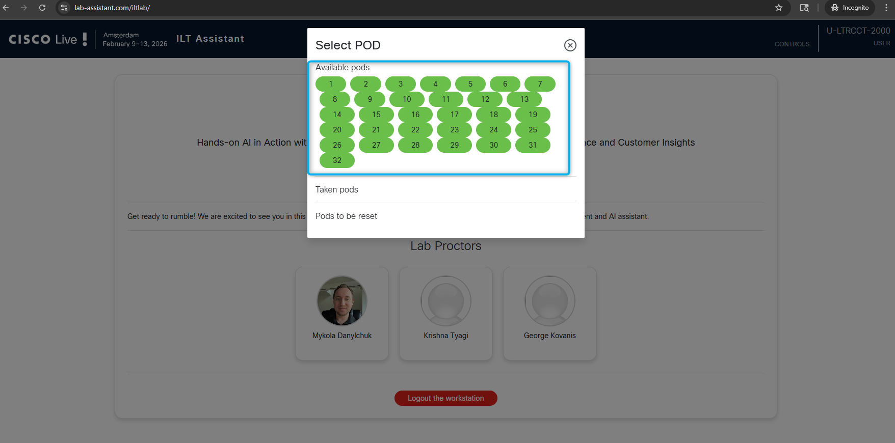
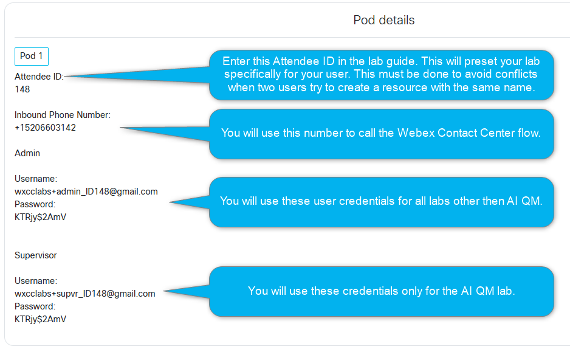

## Get your login credentials

1. In the Chrome browser open the lab access page **<copy>https://lab-assistant.com</copy>**

2. Enter the access code **<copy>462397</copy>** and press **Enter**. 
     

3. Navigate to the **POD** section.
     

4. Look at the bottom of your right screen; you will see tag with your pod number.
     

5. Select the pod that is associated with the number tag attached to your screen.
    

6. Use this Attendee ID and login details to follow the lab. You can copy and paste login credentials and other details into a notepad if this would be convenient for you.
    

<!-- Markdown content with embedded HTML -->

    <h3><b>Please submit the Attendee ID below.</b></h3> 
    <h3>All configuration entries in the lab guide will be renamed to include your Attendee ID.</h3>
    <form id="info">
        <label for="attendee">Attendee ID:</label>
        <input type="text" id="attendee" name="attendee" placeholder="Enter 3 digits" required>
        <button onclick="setValues()">Save</button>
    </form>

     

    
Your stored Attendee ID is:<w class="attendee"> No ID stored</w>

## Overview of the lab's Use Case 

You are designing **Webex AI Agent** for a flower shop to assist customers with answering questions and ordering flowers. To support agents and supervisors with the latest AI tools, you will configure **AI Assistant** features.

### AI Agent Capabilities

- **Recommending flowers based on customer preferences or occasions**
- **Collecting order details for both standard and custom bouquets**  
- **Calculating total price in real time**
- **Gathering delivery information, including address and delivery date**  
- **Order confirmations via SMS**   
- **Transferring to a specific queue with human agents, when needed for complex inquiries**

### Human Agent Support

  - **Provide the agent with a summary of the call**  
  - **Provide live transcripts to improve the understanding of the customer's request**
  - **Suggest a response to the agent based on the knowledge base**  
  - **Generate Post Call Summery**

### Supervisor Support
- **Evaluate agent's quality of service using Evaluation form**  

## Learning Objectives

Welcome to **"Hands-on AI in Action with Webex Contact Center: Enhancing Self-Service, Agent Assistance & Customer Insights - LTRCCT-2000"**

In this lab, participants will:   
 **• Uncover Trends & Opportunities:** Analyze customer conversation data to identify key themes, trends, and automation opportunities for improved service efficiency.   
 **• Integrate Intelligent AI Agents:** Utilize Cisco Autonomous AI Agent to build dynamic, context-aware self-service flows that adapt to customer needs in real-time.   
**• Seamless AI-to-Human Collaboration:** Experience smooth transitions from AI agents to human agents, ensuring continuous context and interaction summaries for effective issue resolution.   
**• Enhance In-Interaction Insights:** Experience AI-driven call summarisation to enhance agent productivity and service quality. 
**• Predict Customer Sentiment:** Learn to leverage AI to forecast customer satisfaction (CSAT) based on interaction data, enabling proactive.  
**• Evaluate Agent's performance:** Learn to leverage AI QM to evaluate the agent's quality of provided service based on the preconfigured template. 
    
## Disclaimer
The lab design and configuration examples provided are for educational purposes. For production design queries, please consult your Cisco representative or an authorized Cisco partner.
Let’s get started and discover how **Webex Contact Center Flow Designer** takes customer experiences from good to great!

